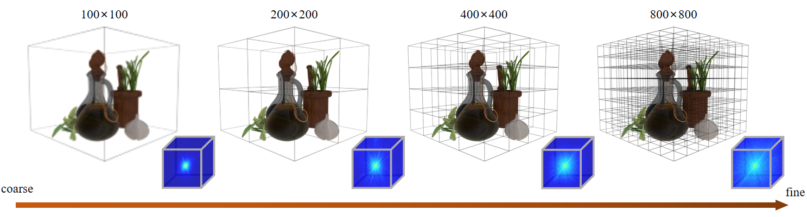

# Pyramid NeRF: Frequency Guided Fast Radiance Field Optimization

Check out the paper on arXiv: https://arxiv.org/abs/2103.13744

This repo contains the code for Pyramid NeRF, more installation details refer to KiloNeRF: https://github.com/creiser/kilonerf

## Prerequisites
* OS: Ubuntu 16.04.1 LTS
* GPU: >= NVIDIA GTX 2080 Ti 
* Python package manager `conda`

## Data
To generate multiscale image datasets run:
`python generate_data.py`
Note that camera intrinsics and extrinsics can be copied from the original dataset, f, cx and cy decrease proportionally.
## Usage

To benchmark a trained model run:  
`bash benchmark.sh`

You can launch the **interactive viewer** by running:  
`bash render_to_screen.sh`

To train a model yourself run  
`bash Chair_train.sh`

The default dataset is `Synthetic_NeRF_Chair`, you can adjust the dataset by
setting the dataset variable in the respective script.
